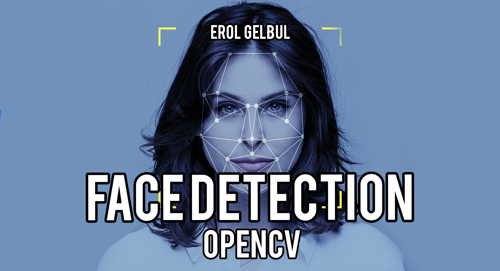

<!-- ABOUT THE PROJECT -->
## Description

I used the OpenCV library to load `faces.jpg` image into my project.
After importing the `CascadeClassifier` I converted the image to grayscale.

(<a href="#top">back to top</a>)

<!-- TECH -->
## Technologies

IDE: [Jupyter Notebook](https://jupyter.org/)

Libraries & Packages: [NumPy](https://numpy.org/), [OpenCV](https://pypi.org/project/opencv-python/)

Download the [Cascade Classifier](https://github.com/opencv/opencv/tree/4.x/data/haarcascades) from OpenCV's GitHub repo.

(<a href="#top">back to top</a>)

<!-- CONTRIBUTING -->
## Contributing

If you would like to add any extra features to the optimisation simulation, feel free to fork and create a pull request. Thank you!

1. Fork the Project
2. Create your Feature Branch (`git checkout -b feature/AmazingFeature`)
3. Commit your Changes (`git commit -m 'Add some AmazingFeature'`)
4. Push to the Branch (`git push origin feature/AmazingFeature`)
5. Open a Pull Request

(<a href="#top">back to top</a>)

<!-- CONTACT -->
## Contact

Erol Gelbul - [Website](http://www.erolgelbul.com) - erolgelbul@gmail.com

Project Link: [Face Detection](https://github.com/ErolGelbul/face_detection)

(<a href="#top">back to top</a>)

